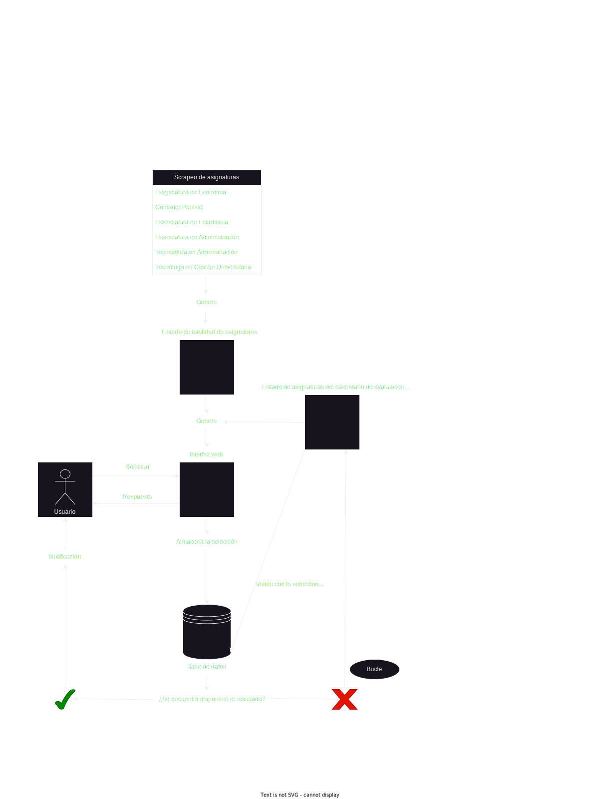

# Proyecto de alerta de resultado
#### _Montevideo, Uruguay._
Última modificación: _25/06/2023_

## Objetivo
El microproyecto "Alerta de resultado" tiene como objetivo principal brindar a los usuarios la capacidad de crear alertas para las asignaturas de su interés durante los periodos académicos establecidos por la universidad.

## Alcance
Si bien el proyecto está inicialmente diseñado para ser utilizado directamente por estudiantes, es importante destacar que su utilidad se extiende más allá de este público específico. De hecho, puede resultar beneficioso para cualquier persona que desee acceder a los resultados y, por ende, podría ser utilizado por profesores particulares con el propósito de mantenerse informados acerca de los avances y, de esta manera, notificar a sus alumnos cuando lo consideren adecuado.

En la actualidad, el proyecto contempla los siguientes tipos de evaluaciones:
-  Revisiones
-  Controles
-  Micropruebas
-  Tareas domiciliarias

## Diagrama de flujo 
A continuación se presenta un diagrama de flujo de procesamiento con el propósito de facilitar la comprensión del funcionamiento del proyecto.

## Periodicidad de ejecución
En relación al diagrama de flujo previamente presentado, es importante destacar que el proyecto exhibe diversas periodicidades en su ejecución, las cuales están sujetas a la naturaleza de las tareas involucradas. 
Son de destacar las siguientes ejecuciones programadas:
- Scrapeo de todas las asignaturas oficiales: Todos los domingos a las 3:00 am GMT-3
Las asignaturas consideradas son las siguientes: 
    - Licenciatura en Economía
    - Contador Público
    - Licenciatura en Estadística 
    - Licenciatura en Administración
    - Tecnicatura en Administración
    - Tecnólogo en Gestión Universitaria
- Screapeo de las asignaturas del calendario: De Lunes a Viernes desde las 8:00 am hasta las 20:00 pm (en interválos de 10 minutos) y los Sábados desde 8:00 am hasta 18:00 pm GMT-3

### Razones de la periodicidad:

El objetivo del proceso de extracción de datos de asignaturas es detectar la presencia de nuevas asignaturas o la eliminación de asignaturas de la lista oficial. Esta operación se lleva a cabo una vez por semana con el propósito de realizar un control, y se ha seleccionado esta periodicidad específica para interferir lo menos posible con el funcionamiento normal de la página.

Por otro lado, el proceso de extracción de datos del calendario constituye la parte central del proyecto. Realizar esta acción cada 10 minutos garantiza una notificación relativamente rápida (en un máximo de 10 minutos después de ingresar la solicitud y una vez que los resultados estén disponibles) y además evita sobrecargar la página principal con solicitudes. Los tiempos consideran el horario posible en el cual los resultados pueden ser cargados en la página oficial. Es por esta razón que los días domingo no se lleva a cabo ninguna extracción de datos.

## Tecnologías utilizadas
En el marco de las tecnologías empleadas en este
proyecto, cabe resaltar las siguientes:
-  Python
-  JavaScript
-  SQL (PostgreSQL)
-  Docker
-  Jenkins
-  Git
-  HTML/CSS

## Limitaciones
Este proyecto presenta ciertas limitaciones que son importantes de remarcar.

### Alcance
Aunque el proyecto abarca un amplio alcance, es importante destacar que no se encuentra completamente finalizado. En particular, se debe tener en cuenta que las instancias de evaluación de tipo "examen" no están contempladas en esta primera versión del proyecto.

### Naturaleza
En una primera instancia, la naturaleza del proyecto implica que éste esta sujeto a posibles errores. Cualquier cambio manual inesperado (tal como puede ser algún cambio de formato) puede generar errores inesperados. 
Existen en marcha sistemas de alerta para detectar dichos errores y solucionarlos tan rápido como sea posible.

### Cantidad de solicitudes esperadas
Considerando la proyección de un bajo nivel de solicitudes concurrentes y la ausencia de una carga significativa en el servidor, se ha determinado prescindir del empleo de un sistema de colas, tal como Apache Kafka o RabbitMQ, para la gestión de las solicitudes.
Esto fue una decisión tomada luego de ponderar los costos de implementación (desarrollo y puesta en producción) y la ganancia de evitar una posible sobrecarga.

### Medio de notificación
En la actualidad, se ha considerado únicamente el correo electrónico como medio de notificación. Si bien este medio brinda mayor seguridad y confianza al usuario al solicitar una alerta, se reconoce que otros medios, como los mensajes al móvil, ofrecen una mayor comodidad. Por consiguiente, se contempla la incorporación de esta funcionalidad en futuras versiones del sistema.

## Próximamente
Las modificaciones efectuadas al proyecto se encuentran sujetas al feedback proporcionado por el usuario. Sin obviar este aspecto, se tiene previsto incorporar nuevas características con el propósito primordial de subsanar las limitaciones identificadas en la sección anterior. A continuación, se exponen detalladamente las modificaciones que se persigue llevar a cabo:
-  Habilitar la notificación vía móvil
-  Incorporar los exámenes dentro de las asignaturas a notificar
-  Transformar la aplicación en una PWA para brindarle al usuario facilidad y comodidad en su uso
-  Implementar un sistema de colas (sujeto a análisis de solicitudes)
